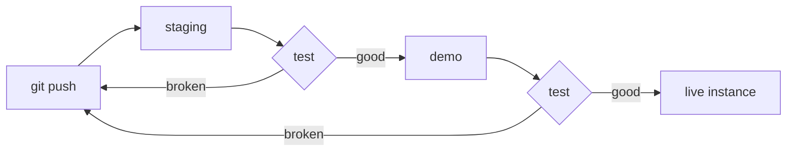
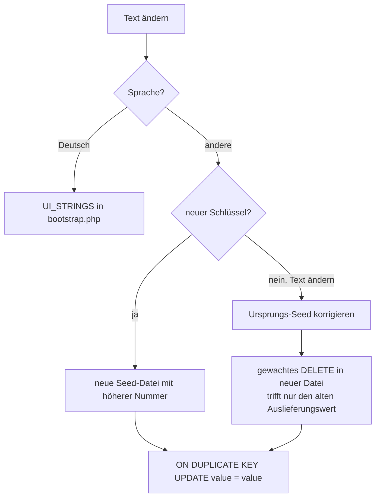

# Contributing

This is about working *on* Bandregie. What the application does and how to run
it is in the [README](README.md) and the
[wiki](https://github.com/computi71/bandregie/wiki).

## How a change reaches the band

Nothing goes straight to the instance a band uses. A change travels:



Each stop is a chance to notice something before six people who are about to go
on stage do. Staging carries data that may be broken; the demo is the last place
where a mistake is merely embarrassing.

**A checkout is not a deployment.** Plesk's git extension has two separate
steps, and fetching alone changes nothing on disk:

```
plesk ext git --fetch  -domain <domain> -name <repo>
plesk ext git --deploy -domain <domain> -name <repo>
```

Afterwards read `VERSION` from the deployed directory — not the tag that was
pushed, the file that is actually lying there. That is the only thing that
proves the deploy step did what its name says.

## Version numbers

`MAJOR.MINOR.FIX`, and the middle digit carries the meaning:

| what changed | digit |
|---|---|
| new behaviour, a feature, anything somebody would notice as new | **minor** |
| a defect repaired, wording corrected, a regression undone | **fix** |

Every release bumps `VERSION` **and** gets a git tag plus a release with notes
that say *why*, not what the lines do. A version without a tag cannot be gone
back to.

## The service worker

`httpdocs/sw.js` carries `const VERSION = 'bandregie-vNN'`. Raise it whenever a
cached asset changes — stylesheet, script, icon. The version is part of the
cache names, so raising it retires the old caches on the next activation.
Forget it and people keep seeing yesterday's page.

One cache deliberately has no version in its name: the one holding the badge
count. It belongs to the person, not to the release, and is cleared only on
sign-out. Wiping it with every update is how the number on the app icon
disappears after every deploy.

## Translations and seeds

German lives in `UI_STRINGS` in `app/bootstrap.php`. The other languages come
from `seed/translations/NN-*.sql`, replayed on every boot, and they only ever
*add* what is missing — a text a band corrected in the application is never
overwritten.



Three things to keep in mind:

1. **The earliest seed wins.** Files are read in `glob()` order, which is
   alphabetical, so `112-` comes before `16-`. Number new files accordingly.
2. **Changing a shipped text takes two steps**: correct it in the original seed
   *and* add a guarded `DELETE` in a new file that removes only the old shipped
   value, so existing databases pick up the new one. Guard by value, so a band's
   own wording survives.
3. **A new permission area needs its help text.** The help page renders one
   section per area and prints a missing text as its own key, in plain sight.
   Each area can have a second paragraph under `help_<area>_2` — the cheap way
   to add a topic without rewriting a grown text six times.
