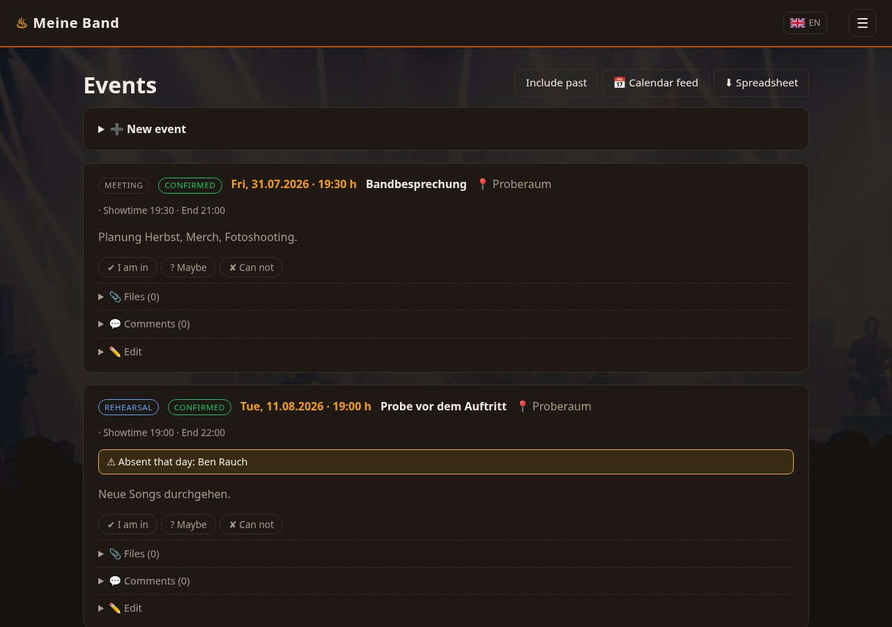
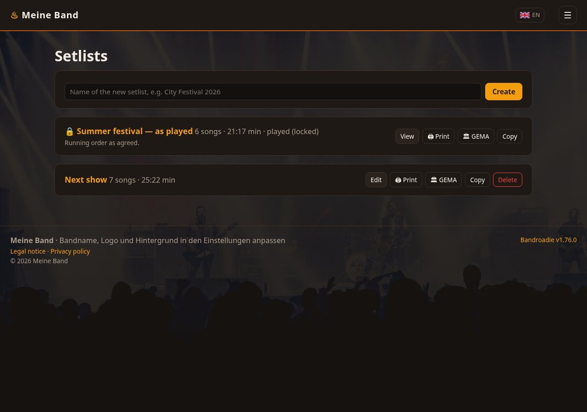
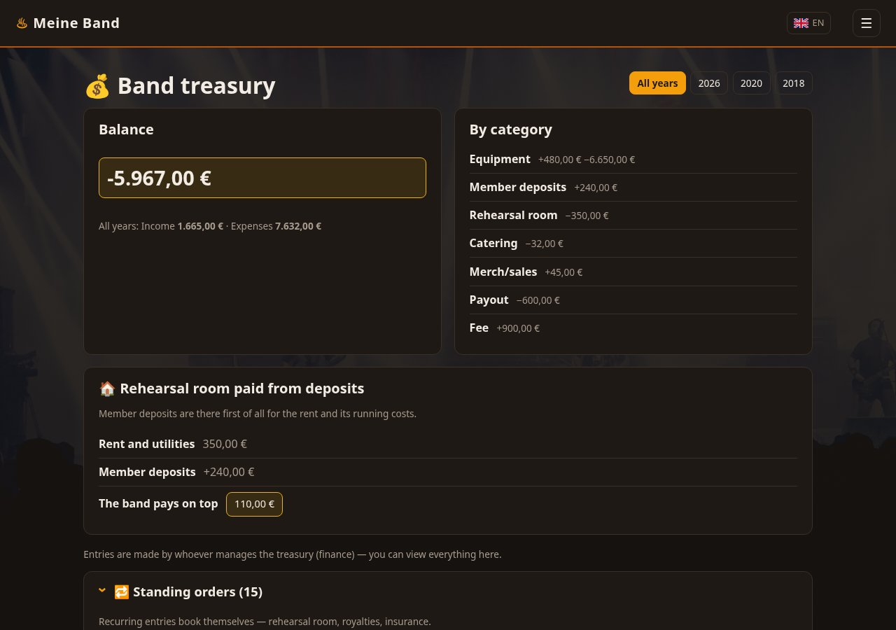
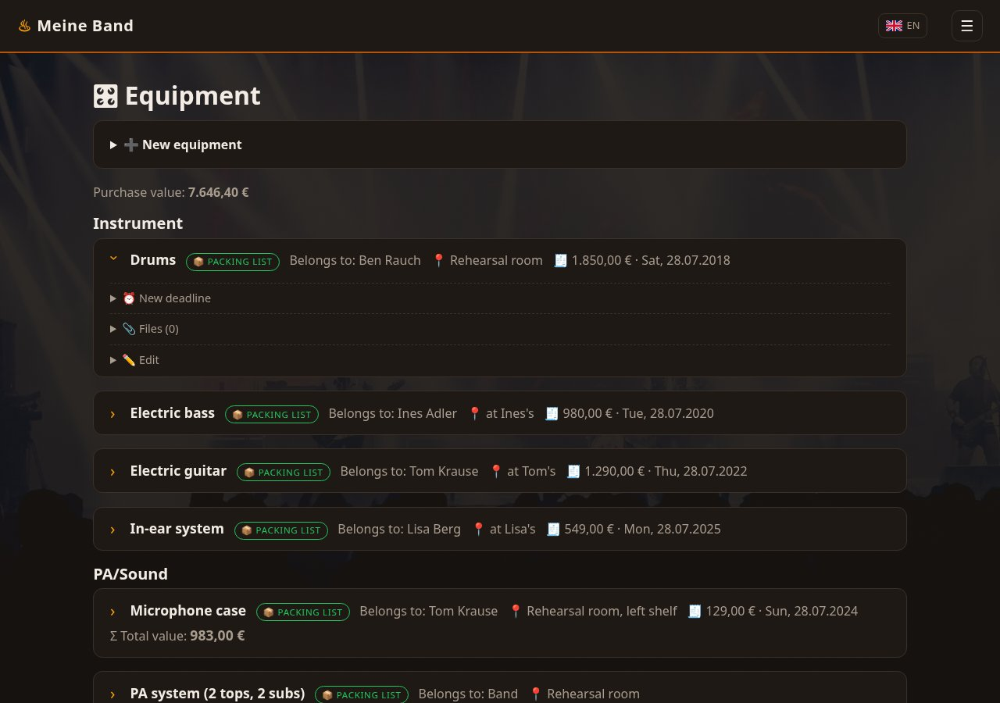
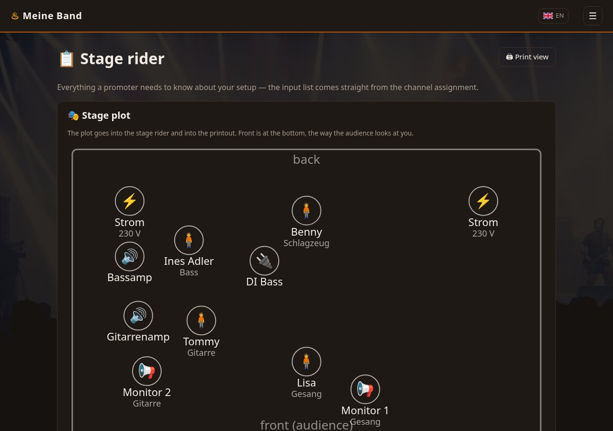

# Bandregie – Band Website & Organization Tool

[**bandregie.info**](https://bandregie.info) · [**Try the demo**](https://demo.bandregie.info) — a full installation with example data, reset every hour, so you can click through everything before installing anything.


**Free for your own band.** Install it, run it, change it, use it for a band
that earns money with its gigs — all covered. The one thing reserved to the
author is offering Bandregie itself as a commercial product or hosted service.
Two years after each release, that restriction lapses and the version becomes
Apache 2.0. See [LICENSE.md](LICENSE.md).

A band of six runs on a group chat, three spreadsheets and one person who
remembers everything. Bandregie replaces that with one place: a public page
for promoters and fans, and an internal area for the work behind it.

## What it is for

**One band, not a platform.** An installation belongs to a single band. No
accounts to manage across bands, no tenant separation to get wrong, no
service in the middle that can disappear. The band owns the server, the
database and the data.

**Answers, not lists.** Who can play on the 14th? What did we play at that
venue last time? Does the rehearsal room cost more than we pay in? Which
microphone is in which case, and what did it cost? Every screen exists
because somebody had to ask that in a chat and wait for an answer.

**Nothing that has to be maintained to keep working.** No framework to
upgrade, no build step, no package lock, no third-party script. PHP and a
database. A band that installs this should still be able to run it in five
years without anyone touching it.

**What is private stays private.** What a member paid for their own
equipment, what they deposit, what they own — visible to them, not to the
band. Permissions are enforced in the route, never only in the interface,
and a stand-in sees the dates they were asked for and nothing else.

## What it does

Public band page plus an internal organization area: events with availability polling (✔/?/✘), status workflow, three times (meet / stage / end), fee tracking and per-event comments; songs with a lifecycle, live-play counters, lyrics and a guitarist's chord sheet — both readable on a full-screen stage teleprompter that scrolls by itself, with the sections colour-coded and the screen kept awake; setlists with pauses, encore markers, copy, a stage-ready print view and a locked history; venues with play history; absences with conflict warnings; tasks, photos, file attachments, member management, a band treasury with standing orders, member deposits and a yearly tax overview, equipment with recurring deadlines, an invoice that can cover several devices at once, an iCal calendar feed, and a stage-ready offline mode: everything is on the phone unless a member takes it off again in their profile — events, setlists with print views, songs with lyrics and chord sheets, the rider, the patch list — and it refreshes itself in the background whenever a page is opened with a signal. A single event can also be taken along with one button.

**White-label:** band name, logo, background image and favicon are configured entirely in the settings — every band makes the instance its own.

**Multilingual:** the interface ships in German, English, Dutch, French, Spanish and Italian; band texts and the legal pages are maintained per language, with a fallback chain (selected language → default language → English → German). Which languages appear is up to the admin — only the default language stays switched on, because something has to be there when nothing else fits — and every string can be corrected in the band area.

**Stack:** PHP 8.1+ with MariaDB/MySQL (PDO), no framework, no build step, no dependencies.

## Screenshots

The demo data ships with the project, so a fresh installation looks like this
straight away — a fictional band with events, songs, a treasury and gear.

| | |
|---|---|
|  **Public page** — what promoters and fans see. Band name, logo and background come from the settings. |  **Events** — availability in one click, absences flagged before anyone drives anywhere. |
|  **Setlists** — breaks and encores in place, with a print view for the stage. |  **Treasury** — standing orders book themselves; deposits are set against the rehearsal room rent. |
|  **Equipment** — cases within cases, purchase prices only the owner sees, deadlines for what needs testing. |  **Stage rider** — a plot the promoter can read, from the members and their instruments. |

More: [songs](docs/screenshots/songs.jpg) · [members and permissions](docs/screenshots/members.jpg)

## Installation

Requirements: PHP 8.1 or newer with `pdo_mysql`, `fileinfo`, `gd` and `exif`
(the last two strip location data out of uploaded photos and match them to
events — the system check names what is missing), MariaDB 10.4+
or MySQL 8, and a web server. The examples use nginx with PHP-FPM on Debian;
Apache works too (see below).

### 1. Database

```sql
CREATE DATABASE bandregie CHARACTER SET utf8mb4 COLLATE utf8mb4_unicode_ci;
CREATE USER 'bandregie'@'localhost' IDENTIFIED BY 'YOUR-PASSWORD';
GRANT ALL PRIVILEGES ON bandregie.* TO 'bandregie'@'localhost';
```

### 2. Code

Clone the repository somewhere outside the web root, for example
`/var/www/bandregie`, then copy `app/config.example.php` to `app/config.php`
and fill in the credentials above.

Only `httpdocs/` may be served publicly. `app/` holds the code and your
database password, `data/` holds uploads and file attachments, `seed/` holds
the translation files — none of them belong in the document root.

### 3. nginx

```nginx
server {
    listen 80;
    server_name band.example.com;

    # The document root points *inside* the project: everything above
    # httpdocs (app/, data/, seed/, config.php) stays unreachable.
    root /var/www/bandregie/httpdocs;
    index index.php;

    # Must be at least as large as the biggest upload you want to allow
    # (attachments are capped at 20 MB in the app), plus form overhead.
    client_max_body_size 30m;

    # Single front controller: serve real files (CSS, JS) directly and hand
    # every other path to index.php, which does the routing. Uploaded images
    # are not files here — they are served by index.php from outside the root.
    location / {
        try_files $uri /index.php$is_args$args;
    }

    location ~ \.php$ {
        include snippets/fastcgi-php.conf;
        fastcgi_pass unix:/run/php/php8.3-fpm.sock;   # match your PHP version
    }

    # Stylesheets and scripts carry the release in their address
    # (/assets/style.css?v=1.42.0), so the browser may keep them and still
    # gets the new file after an update. Without this it revalidates every
    # one of them on every page view. Apache installs get the same from the
    # .htaccess that ships in httpdocs/; nginx cannot read that file.
    location /assets/ {
        expires 1y;
        add_header Cache-Control "public, immutable";
    }

    # The service worker carries no version in its address and must always be
    # revalidated. If it were long-cached, an installed web app (iPhone home
    # screen) would never see new releases and stay on the old version forever.
    location = /sw.js {
        add_header Cache-Control "no-cache, max-age=0, must-revalidate";
    }

    # Never expose version control or Apache leftovers
    location ~ /\.(ht|git) { deny all; }
}
```

Enable it and reload:

```bash
sudo ln -s /etc/nginx/sites-available/bandregie /etc/nginx/sites-enabled/
sudo nginx -t && sudo systemctl reload nginx
```

### 4. PHP upload limits

PHP's defaults (2 MB per file, 8 MB per request) are smaller than what the
app offers, and PHP discards oversized uploads before any code runs. Raise
them in your PHP-FPM pool or `php.ini`:

```ini
upload_max_filesize = 25M
post_max_size = 30M
```

Keep `client_max_body_size` in nginx at or above `post_max_size`. Bandregie
reports rejected uploads instead of failing silently, but only the server
settings decide what actually gets through.

### 5. Permissions

The web server user needs write access to `data/`, and read access to
`app/config.php` — it holds the database password, so keep it off-limits for
everyone else:

```bash
sudo chown -R www-data:www-data /var/www/bandregie/data
sudo chown root:www-data /var/www/bandregie/app/config.php
sudo chmod 640 /var/www/bandregie/app/config.php
```

Use the account that deploys the code as the owner if you pull with a
non-root user. Note that with OPcache enabled a permission mistake here can
stay hidden until the next PHP-FPM restart.

### 6. TLS

Logins, the member area and the calendar feed should never run over plain
HTTP: `sudo certbot --nginx -d band.example.com`.

### 7. First run

Open the site. All tables are created and the translations are imported
automatically. An administrator account is created with a random password,
written once to `data/INITIAL-PASSWORD.txt` (outside the web root). Log in with
it and set your own password when prompted — the file is deleted at that
moment, so it never outlives the password it holds. Then change the email
address under *Profil*.

Under *Settings → Demo data* one button fills the installation with a fictional
band so you can explore every feature, and a second button removes exactly
those rows again. The demo accounts get random passwords, written once to
`data/DEMO-LOGINS.txt` — log in as a member or as the stand-in to see how much
less they are shown. Removing the demo deletes the accounts and that file.

### Apache instead of nginx

Point the `DocumentRoot` at `httpdocs/`, allow `.htaccess` overrides
(`AllowOverride All`) and enable `mod_rewrite` — the shipped `.htaccess`
routes everything to `index.php`. Set `upload_max_filesize` and
`post_max_size` as described above.

### Mail

Member invitations and password resets use PHP's `mail()`. The host must be
able to deliver mail for your domain; send from an address on that domain
(the app uses `no-reply@<your-domain>`) so SPF checks pass.

### Address search, navigation and photo metadata

**Address search** is off by default. When switched on in the settings, looking
up an address sends it once — from the server, not the browser — to
OpenStreetMap's Nominatim to fetch coordinates, so navigation can be precise.
The app honours Nominatim's usage policy: one request per click (no typeahead),
with a proper User-Agent. Without the switch nothing leaves the server.

**Navigation** opens the device's own maps app: `geo:` on Android (the user's
configured default), a small chooser on iPhone (Apple Maps, Google Maps, Waze,
OpenStreetMap — iOS does not expose the system default to web pages), and an
OpenStreetMap link on the desktop. The app fetches nothing; the destination
goes to whichever app the member picks, under that vendor's terms.

**Photo metadata**: on upload the capture date and GPS coordinates are read
from the file (needs the `exif` extension) and stored in the database for
suggesting which event a photo belongs to. The metadata is then **removed from
the stored file** (needs the `gd` extension), so coordinates —
a rehearsal room is often somebody's home — do not travel with a published
photo. Only originals straight from a device carry metadata at all; copies
shared through messengers or social platforms have already lost it.

**Privacy policy**: the shipped template covers every one of these processing
activities, including the optional ones, with bracket placeholders to fill in.
If you add an outgoing service, add its paragraph in the same change.

### Push notifications (on by default, switchable)

Push is available out of the box; an administrator can switch it off under
*Settings → Outgoing connections*, where everything this installation can do
towards the outside sits together. All three topics are preselected per
member, so members untick rather than tick — but nothing is sent until a
member registers a device from their profile, where the browser asks for
permission itself. Recipients only ever get notifications for events
they may see in the member area. Works on Android and, for the
installed home-screen app, on iOS 16.4+. The VAPID key pair is generated
server-side on first use (stored sealed when an encryption key is
configured); no third-party service and no library involved — messages are
encrypted per RFC 8291 and sent directly to the browser vendors' push
endpoints. Browsers without push support simply never see the buttons.

### Sign in with Apple, Google or Facebook (optional)

Members can sign in through an existing account instead of the e-mail
password. Every provider is **off** until an administrator enters its
credentials in the settings — without them no button appears and nothing
phones home. Matching is strict: a sign-in either uses an existing link or
the provider's **verified** e-mail address of an existing member; an account
is never created from a sign-in alone. The e-mail password always keeps
working, so nobody is locked out when a provider is unreachable.

Setup per provider: create an OAuth client in the provider's console, enter
the redirect address shown in the settings (`/auth/<provider>/callback`,
built from the fixed site address), and paste the client ID and secret.
Apple needs the Service ID, Team ID, Key ID and the `.p8` private key —
the short-lived client secret JWT is generated from it on each request.
Facebook only hands out e-mail addresses after its app review. Secrets are
stored sealed when an encryption key is configured.

### Backups

Back up the database and the `data/` folder. Updating the code never touches
either, but never overwrite `data/` or `app/config.php` when deploying.

### Plesk: close the statistics directory

Plesk publishes AWStats reports under `/plesk-stat/`, and by default anybody
who knows the address can read them. They contain the IP addresses of your
visitors, the pages they asked for and where they came from — personal data
under GDPR Art. 4, sitting in front of no login at all.

*Websites & Domains → Hosting & DNS → Web Statistics* → tick **accessible via
password-protected directory**, or:

```bash
plesk bin domain --update yourdomain.tld -webstat-protdir-access true
```

The system check tests this on a Plesk installation and says so when the
directory answers to everyone.

### Encryption at rest

A backup travels — to a NAS, an FTP target, a cloud — and the band's treasury
travels with it. Set an encryption key and it does not travel in the clear:

```bash
php app/backup.php key
```

Put the line it prints into `app/config.php` as `data_key`. From then on
backups are written as `.tar.gz.enc` and attachments are sealed on disk;
existing attachments can be sealed afterwards under *Settings → Encryption at
rest*. XChaCha20-Poly1305 from libsodium, authenticated, so a tampered archive
is refused rather than half-restored.

**Keep the key where you keep the database password — and not inside the
backup it protects.** Without it an encrypted backup cannot be opened by
anyone, including you.

What is *not* encrypted, and why: the live database, because the server has to
sort and sum in it; and `data/uploads`, because the web server hands those
files out directly. Attachments under `data/files` go through a permission
check and are sealed.

The system check verifies that the encryption actually works — it seals,
opens, then flips a byte and confirms the result is refused. GDPR Art. 32(1)(d)
asks for effectiveness to be tested, not intended.

### Restoring on a new server

The key is in `app/config.php`, and `app/config.php` is not part of the
backup. On a fresh machine, in this order:

1. Install the code and create the database (steps 1–3 above).
2. Write `app/config.php` — database credentials **and the same `data_key`**
   as the old server.
3. Copy the archive to `data/backups/`, or upload it under *Settings →
   Backup*.
4. Restore:

   ```bash
   php app/backup.php restore bandregie-YYYY-MM-DD-HHMMSS.tar.gz.enc
   ```

The restore refuses to start if the archive cannot be opened — with no key,
or with the wrong one, nothing is touched and the message says which of the
two it was. It also writes a safety copy of the current state before replacing
anything.

Walk both paths once on a spare installation before you need them: a restore
nobody has tried is a hope rather than a plan.

### Tax figures

Under *Settings → Tax values* a band can say that it uses the German
small-business rule (§ 19 UStG). The treasury then counts turnover against
both limits and warns before one is crossed — fees, merch and sold gear
count, member deposits do not, because they are contributions rather than
sales.

Every figure is a setting, because legislatures move them and because not
every band sits in Germany. The defaults are the German position as of July
2026: **25.000 €** for the previous year and **100.000 €** for the current
one, and **800 €** net as the line above which equipment is written off over
its useful life rather than at once (§ 6 Abs. 2 EStG).

Each year has an overview under *Treasury → Tax overview*: income and
expenses by category with the entries behind them, and the purchases that
belong in neither — a device above the low-value line spreads over its useful
life, counted from the month of purchase, so a purchase never sits in the
expenses as well. Both the line and the useful life are settings. Everyone
gets their own private entries; whoever keeps the treasury can also switch to
the band's figures. Neither view contains the other, and no member ever sees
another's private purchases. The sheet prints, and it exports as a table — or as a package that carries the receipts with it: the attachments of that year's entries and the invoices of equipment still being written off, whose paper sits in the year of the purchase. An invoice covering several devices is enclosed once.

Each value carries the date it was last confirmed. The system check says so
once that date is more than a year old, and a new release may ship better
defaults but never overwrites a figure a band has set — the release notes
name any change. There is no automatic lookup: no reliable machine-readable
source exists for this, and a band's server should not depend on one.

This is arithmetic, not tax advice.

### Version numbers

`Major.Minor.Fix`, read from the one question that matters before an update —
**can I just pull, or do I have to do something?**

- **Fix** — repairs only, nothing behaves differently. Update whenever.
- **Minor** — new features or changed behaviour, applies itself. Just update.
- **Major** — either the operator has to act (a manual database step, a newer
  PHP, changed server configuration), or so much has changed that the release
  notes are worth reading first: a whole new area, a reworked interface, a
  fundamentally different workflow.

This is semantic versioning with its major bump defined for a self-hosted
application rather than a library: there is no API here for anyone's code to
break against, so "breaking" is measured against the person running the
server. Every release is tagged and carries notes.

### Updating

The application never updates itself. Giving the web server write access to
its own code turns any future file-write bug into a permanent takeover, which
is a poor trade for two saved seconds. *Settings → Update* shows the installed
and the latest version and names the command for **your** installation.

**Git checkout.** The shipped script backs up the database and `data/` first
and refuses to continue if it cannot:

```bash
sh bin/update.sh
```

Run it as the user who owns the checkout. The backup runs as the web user, so
either be that user or allow `sudo -u www-data` for it. Set `BANDREGIE_WEBUSER`
if your web server runs as somebody else.

To have it run by itself, put it in that user's crontab:

```
30 4 * * 1  sh /var/www/bandregie/bin/update.sh >> /var/log/bandregie-update.log 2>&1
```

**Plesk.** The deployed directory is not a git checkout — Plesk keeps the
repository elsewhere and copies files into place, so `git pull` there would do
nothing. Take a backup in the settings first, then:

```bash
plesk ext git --fetch -domain YOUR-DOMAIN -name bandregie
plesk ext git --deploy -domain YOUR-DOMAIN -name bandregie
```

**Neither.** Copy the new files over the old ones, but never `data/` or
`app/config.php` — and take a backup before you start.

Database changes run on the next page view either way; there is no migration
step to remember.

**Staged rollout.** With more than one installation, update in stages instead of
all at once: a staging copy first, confirm it works, and only then the instance
that holds real data — so untested code never reaches it. Whichever way you
deploy, never let it overwrite `data/` or `app/config.php`, and on Plesk leave
"remove files that are not in the repository" off: a stray tick there is the one
thing that can delete a band's uploads. Take a backup before each production step.

### Development

For quick local work PHP's built-in server is enough — it needs no web server
config, but it is single-threaded and not meant for production:

```bash
php -S localhost:8090 -t httpdocs httpdocs/index.php
```

## Legal pages (Germany)

The public site ships with an imprint and a privacy policy, both editable per
language in the settings and excluded from search engines. Embedded YouTube and
Spotify players use a two-click consent flow by default (GDPR / § 25 TDDDG);
the admin can switch to loading them directly. The public site can also run in
redirect mode — visitors are forwarded to a social profile while the member
area, the calendar feed and the legal pages stay reachable.

Placeholders in square brackets in the imprint and privacy texts must be
replaced with your own details before going public. These templates are a
starting point, not legal advice.

## Layout

- `httpdocs/index.php` — router / all routes (single public entry point)
- `httpdocs/assets/` — stylesheet and small scripts (lightbox, password strength)
- `httpdocs/.htaccess` — URL rewriting
- `app/bootstrap.php` — database schema, migrations, helpers, auth, UI strings
- `app/config.php` — database credentials (not in git; template: `config.example.php`)
- `app/views/` — templates (public + internal)
- `seed/translations/` — translation seeds, imported automatically on first run
- `data/` — uploads and attachments (outside the webroot, created automatically)

## Security

Found a hole? Please report it privately first — see [SECURITY.md](SECURITY.md).

## Contributing

German is the source language for the interface: new strings go into
`UI_STRINGS` in `app/bootstrap.php` and are then translated in
`seed/translations/`. Code comments and commit messages are English.

By contributing you agree that your contribution is licensed under the
project's license and that the author may also use it under other terms,
including commercially. This keeps it possible to offer Bandregie as a
service later without having to track down every contributor. Contributors are
credited in `CONTRIBUTORS` and shown in the member area.

## Supporting the project

If Bandregie saves your band an evening of spreadsheet wrangling, there is a
Sponsor button at the top of the repository. Entirely optional — the licence
does not change either way.

## License

[Functional Source License 1.1 with Apache 2.0 future license](LICENSE.md)
(FSL-1.1-ALv2), copyright 2026 Michael Rothe.

In plain words: any use is permitted except a *competing use* — making
Bandregie available to others as a commercial product or service that
substitutes for it. Running it for your own band, modifying it, redistributing
it and building on it are all fine. Each released version additionally becomes
available under Apache 2.0 two years after its release.

This is a source-available license, not an OSI-approved open source license,
because open source by definition may not restrict commercial use. GitHub
therefore displays it as "Other".

## Roadmap

See the GitHub issues and milestones: IMAP import of booking requests, and
linking a cloud folder for files and photos. No native app is planned — the
installable web app does the same job without a yearly fee, a review queue on
every change, and a second codebase to keep alive.
